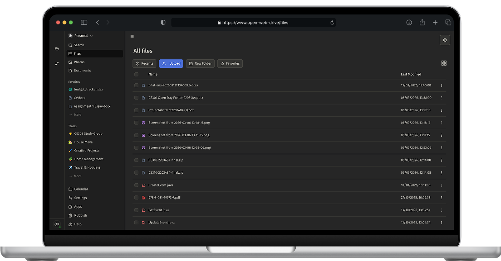

<h1 align="left">Open Web Drive</h1>

<p align="left"> 


</p>

## 🛠️ About This Project

<p align="left">
  
  
  
  
  
  
  
</p>

**Open Web Drive** is a self-hostable, open-source cloud storage solution that combines the familiar user experience of mainstream cloud platforms with total ownership over your data and infrastructure.
Built for privacy-conscious individuals and homelab enthusiasts, it provides file management, client-side encryption, and integration with your preferred OAuth2 / OIDC identity provider.

<p align="center">
  
</p>

## 🚀 Quick Start

> [!NOTE]
> Auth / Client-Side Encryption are currently undergoing a full re-write.


```shell
git clone https://github.com/OliverKeefe/open-web-drive.git \
cd open-web-drive

# Install Frontend dependencies
cd frontend && npm install && cd ..

# Download Backend dependencies
cd backend && go mod download && cd ..

# Run local build script
chmod +x scripts/build.sh
./scripts/build.sh -d
```

📄 License
Distributed under the MIT License. See `LICENSE.md` for more information.