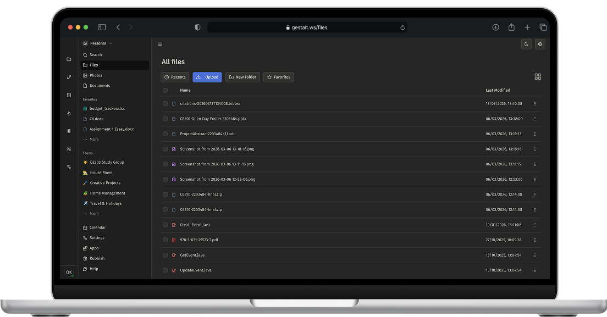

<h1 align="center">GESTALT</h1>

  

  

<h2>An Open Source, Cloud-Agnostic Workspace, File Storage and Collaboration Platform.</h2>

Unify all of your Productivity, Collaboration and File Storage needs in a single web based platform
with Privacy, Security and Disaster Resilience at its core.

> [!NOTE]
> While many features are functional, Gestalt is still in development. Exercise caution when running in production environments.

